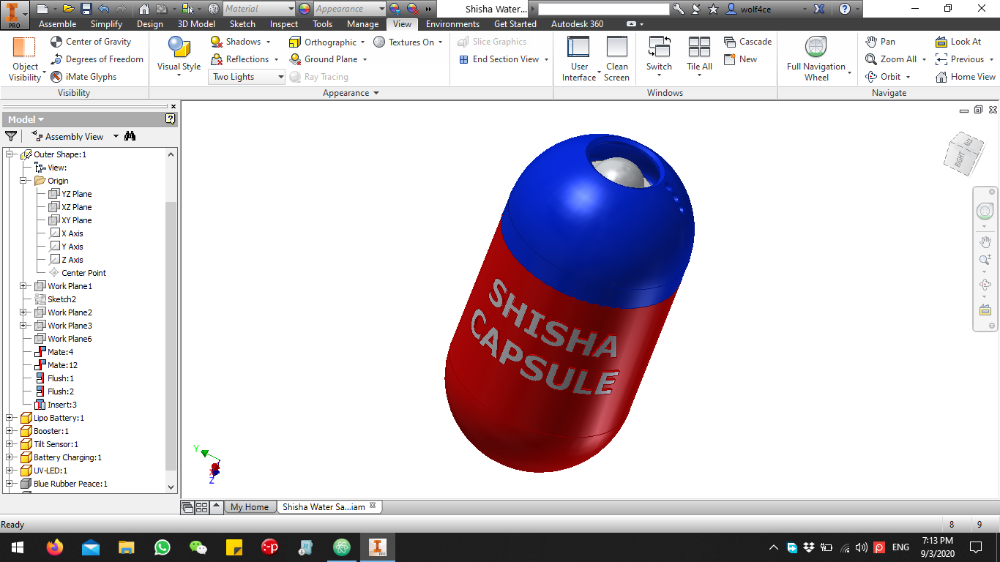
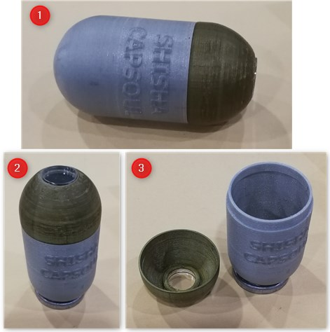

# Shisha Capsule - Project
the shisha capsule project is to build a prototype where it can pass through a shisha bottle neck and drops into the water where its main purpose is to keep floating and sterilize the water from bacteria and viruses using a submergible UV light.

## 1st approach (Planning)
build a 3D printer body and sealed from water, that can easily go in and out from the shisha bottle neck flawlessly. the shape should be user friendly and don't cause injuries.

Note: 1st model was designed by Autodesk inventor.

after successful water test of positioning with weights and floating we moved on to the next phase of the prototype 2nd design approach

## 2nd approach (Building Prototype)
build a 3D printer body that can accommodate the submergible UV light and yet seal the water flowing inside through the light screw thread. and can carry a weight made of lead to keep it facing down words when submerged and accommodate the basic electronics components like the following

* Battery.
* Battery Management Circuit.
* Tilt switch.
* Buck Boost Converter.
* UV Light

1st Model - Lower Area Thread

1st Model Section Analysis

2nd Model - Upper Area Thread

### Design details are as the following

* 3D Design & Visualization
* Circuit Block Diagram
* Circuit Module Connection
* Testing The Circuit In Practical

finally test it in sealing water and in floating. do a lab test to see the amount of bacteria eliminated by the UV light.

## 3rd approach (Building A Smart Prototype Version)
we developed an internal structure to help us easily assemble the shisha capsule together.

### Features
1. We embed the LED to the internal structure slot then we pass the wires through a hole. to be soldered in the circuit on the other side.
2. The Internal structure have a long thread then a nut to trap a ring solder weight to it.
3. Ring weight made of solder.
4. The body on the internal structure is hollow, in order to accommodate the circuit and the battery and the charging and management board. Also The Internal body have a termination ring in order to prevent the user to move it or put any objects in by any chance.
5. The Internal structure have a cap too to protect the circuit from internal leak.

### Internal Structure Side View

### Internal Structure Section Analysis

### Internal Structure Within The Original Body Section Analysis

### Electronic Circuit Diagram

